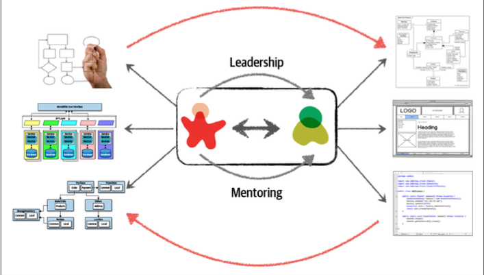
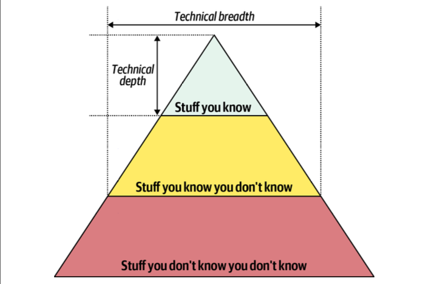

# I. Introduction

## Defining Software Architecture:

- **Structure** (ex: microservices, layered, microkernel)

- **Architecture characteristics**: success criteria for each system.
    - Examples:
        - availability
        - reliability (not fail)
        - testability
        - scalability
        - security
        - agility (adaptable to change)
        - fault tolerance (if it fails, dont break)
        - elasticity (adapt to fast changes)
        - recoverability (ability to restore after failure)
        - performance
        - deployability 
        - learnability

- **Architecture decisions**: rules that we set for ourselves (ex: only business and service layer can access persistence layer). (Exceptions should be analized, but not give for granted).

- **Design principles**: these are guidelines, not rules. They are general in order to be adapted to each case (ex: use async messaging  between your microservices to increse performance. Does not specify which protocol such as rest or gRPC).
	
## Expectations:

- **Make architecture decisions** (guide technology decision, without neccessarilly making them).
- **Continually analyze the architecture**
- **Keep current with latest trends**
- **Ensure compliance with decisions**
- **Diverse exposure and experience**
- **Have business domain knowledge**
- **Possess interpersonal skills**
- **Understand and navigate politics** (your decisions will be challenged because they imptact on multiple teams and people)
	
## Intersection of Architecture and...

- **Engineering Practices**: antiquated processes make software architecture harder. 
    - Orthogonal to software process. Ex: Continuous Integration.
- **Operations/DevOps**.
- **(Software development) Process**. Should be mostly orthogonal, but:
    - Agile -> more and faster feedback.
    - Strangler Pattern (progressive migrations).
    - feature toggles/flags
- **Data**.

## Laws of Software Architecture.

- "Everything in software architecture is a trade-off."
    - "If an architect thinks they have discovered something that isn’t a trade-off, more likely they just haven’t identified the trade-off yet."
- "Why is more important than how."
	
# II. Architectural Thinking

## Architecture Versus Design

- "For an architect is worth having more technical breath rather than technical depth"

## Technical Breadth

## Analyzing Trade-Offs

- Check pros and cons (specially cons) of each option and make a decision based on business drivers, environment, etc

## Understanding Business Drivers

- "Thinking like an architect is understanding the business drivers that are required for the success of the system and translating those requirements into architecture characteristics (such as scalability, performance, and availability)".

## Balancing Architecture and Hands-On Coding

- If possible work on production code that is not part of the critical path.
- Alternatives:
    - Proofs of concepts. Ex: to compare technology options for a part of the system.
    - Technical debt/low priority features.
    - Fixing bugs.
    - Create tools for the devs or other teams (ex: CLIs or automate repetitive tasks).
    - Architectural analysis automation.
    - DO CODE REVIEWS.